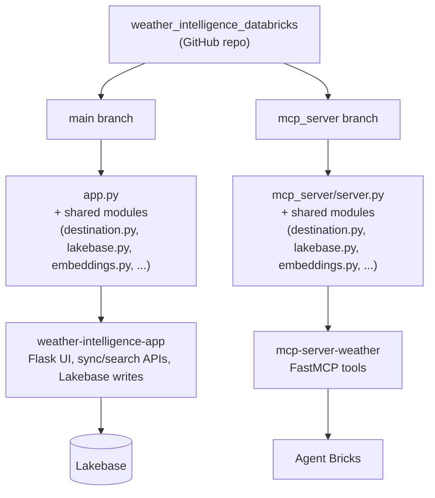

# Weather-Aware AI Trip Planner

An end-to-end AI agent that plans trips by combining live weather, semantic destination search, routing, and itinerary management — using Databricks Free Edition.

## What it does:

- An [Agent Bricks](https://www.databricks.com/product/artificial-intelligence/agent-bricks) agent that talks to a set of MCP tools to plan real, weather-aware trips
- A demonstration of a full Databricks stack in one project: Spark data pipelines, Lakebase (Postgres + pgvector), Databricks Apps, and MCP-based tool orchestration

## Architecture

```text
User
 ↓
Trip Planner App / UI
  ↓
Agent Bricks
  ↓
MCP Tools
  ├── Weather
  ├── Semantic Search (destinations + weather)
  ├── Destination / Attractions
  ├── Routing
  └── Itinerary
        ↓
     Lakebase
```

Two Databricks Apps make this up:
- **`weather-intelligence-app`** — Flask UI, sync/search APIs, and all the Lakebase writes (Postgres + embeddings)
- **`mcp-server-weather`** — the FastMCP server Agent Bricks actually talks to

## Repo structure — two branches, one shared codebase

Each Databricks App deploys from its own branch:



- **`main`** — deploys `weather-intelligence-app`. Entry point `app.py`. Handles the UI, the sync/search HTTP APIs (including the endpoint the Bronze/Silver job calls to write into Lakebase), and every direct Lakebase write.
- **`mcp_server`** — deploys `mcp-server-weather`. Entry point `mcp_server/server.py`. Exposes the FastMCP tools Agent Bricks actually calls, including the live single-city ingestion fallback.

Both branches carry their own copy of the shared modules (`destination.py`, `lakebase.py`, `embeddings.py`, and the rest). That's deliberate, not an oversight: a Databricks App requires `app.yaml` at the root of its own deployed source, and a source scoped to a subfolder doesn't pull in sibling files — so with two apps needing two different entry points, each needs a fully self-contained branch rather than one shared folder structure. The one rule that keeps the duplication from becoming drift: a shared module only ever gets edited on one branch, then merged into the other — never edited independently on both.

## What's built:

- **Weather** — live current conditions, multi-day forecast, and an "umbrella needed?" check, all straight from the National Weather Service (NWS) API
- **Destination search** — Geoapify-sourced attractions, semantically searchable via embeddings in Lakebase
- **Live city ingestion** — if a user asks about a city that isn't in the system yet, the agent fetches and embeds it on the spot mid-conversation, no manual backfill needed
- **Routing** — travel time/distance between planned stops via OpenRouteService
- **Itinerary management** — create, extend, list, and update saved trip itineraries
- **Automated data pipeline** — a scheduled Databricks Job (Bronze → Silver, Spark) keeps a configurable list of tracked cities' destination data fresh on its own
- Confirmed working end-to-end through Agent Bricks: a single trip-planning conversation chaining weather, search, routing, and itinerary saving together (***see [`screenshot`](./screenshot)***)

## Tech stack

Databricks Free Edition · Lakebase (Postgres + pgvector) · Spark (Bronze/Silver) · FastMCP · Flask · Agent Bricks · Geoapify · National Weather Service API · OpenRouteService · sentence-transformers

## Setup

1. Clone the repo (both `main` and `mcp_server` branches) and set up a Databricks Free Edition workspace with a Lakebase instance
2. Run `secrets_setup.py` to store API keys as Databricks secrets
3. Deploy both apps — `weather-intelligence-app` and `mcp-server-weather` — wiring each one's Resources tab (SQL Warehouse, Unity Catalog table, secrets) to match its `app.yaml`
4. Seed `tracked_locations` with your starting cities and schedule the Bronze/Silver Databricks Job
5. Connect `mcp-server-weather` to Agent Bricks and start planning